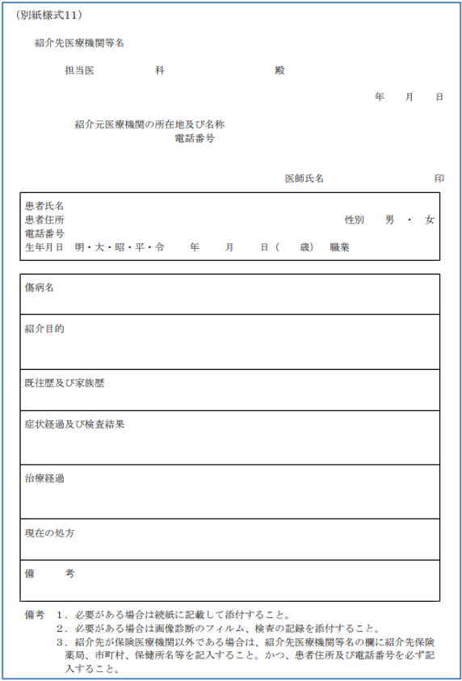

日本HL7協会 日本医療情報学会　2021年10月承認 　改訂Ver. 1.1.1 (2022.12.13) 

# **診療情報提供書HL7FHIR記述仕様 第1版**
## 本仕様書の位置づけ
この仕様書は、HL7FHIR（以下、単に「FHIR」という）に準拠した診療情報提供書の記述仕様を記述した文書であり、令和2年度厚生労働行政推進調査事業費補助金令和2年度厚生労働科学特別研究事業「診療情報提供書,診療情報提供書等の電子化医療文書の相互運用性確保のための標準規格の開発研究」(課題番号20ⅭＡ2013）（以下、単に「R2厚生科研研究班」という）の成果物を、その作成者らが編集したものである。
以下では本仕様書という。
本仕様書は、厚生労働省標準HS008「診療情報提供書（医療機関への紹介状）（日本HL7協会）」（以下、「診療情報提供書CDA規約」、もしくは単に「CDA規約」という）を参考にして、FHIRに準拠した記述仕様として作成されたものであり、電子化に伴う新たな診療情報提供書様式のあり方を再検討して作成されたものではない。
また、本仕様書の作成にあたって、ベースとした仕様には、FHIRR4に修正を加えたVer.4.0.1(Oct-30,2019)を採用しているが、それ自体がNormative（標準）として確定した仕様となっていないものを多く含んでいる。そのため、元となるFHIR仕様が変更されることがあるが、本仕様書の明示的な改版時まではその変更の影響を受けないものとする。

## 参照する仕様等
本仕様書は、以下の仕様等を参照して作成されている。
HL7FHIRR4Ver.4.0.1[[http://hl7.org/fhir/index.html](http://hl7.org/fhir/index.html)]　本仕様書ではFHIR基底仕様という。
厚生労働省標準HS008「診療情報提供書（医療機関への紹介状）」（日本HL7協会）[[http://www.hl7.jp/intro/std/HL7J-CDA-005.pdf](http://www.hl7.jp/intro/std/HL7J-CDA-005.pdf)]

 [→topへ](index.html) 

## 文書データの表現形式
### ファイル形式
ファイル形式は、JSON形式（JavaScriptObjectNotation：RFC8259、IETFSTD90、ECMA-4042ndedition）とする。
ファイル名を有するファイルを作成する場合には、特に送受信施設間で別の取り決めがない限り、.jsonの拡張子を末尾に付与するものとする。
###文字集合
文字集合はUnicode文字セットとする。これはISO/IEC10646：2017（JIS　X0221国際符号化文字集合）と同一である。
###符号化形式
文字符号化形式は、UTF-8（ISO/IEC10646　UCSTransformationFormat8）とする。ネットワーク上で直接データを送受信することを想定し、バイト順マーク（BOM：byteordermark：UTF-8では0xEF0xBB0xBF）を先頭に付与しないものとする。

 [→topへ](index.html) 

## 診療情報提供書FHIR記述の全体構造
### 全体構造
FHIRでは、医療情報はFHIRリソースと呼ばれる単位で記述される。診療情報提供書は文書形式のデータの一種であり、また診療情報提供書文書本体に必要なら電子署名ができ、またそれを利用して改ざん検知及び否認防止ができることが必要であると考えられる。
Bundleリソースは、複数のFHIRリソースの集合を、あるコンテクストに関する情報（この場合には、診療情報提供書の交付と取得に関する日付情報や発行者、発行機関情報など）とともにひとまとまりの情報にまとめあげたものを記述するのに使われるFHIRリソースであり、以下のような要素から構成される。あるシステムから別のシステムに診療情報提供書を送信する場合は、このBundleリソースの単位で行われる。

 
図1 Bundleリソース（http://hl7.org/fhir/bundle.html）

そして、このBundleリソースのtype要素（上図左段の2つめの要素）の値を"document"とすることにより、Bundleリソースのひとつのタイプである、FHIRDocumentを記述できる。
そこで、本仕様書では、診療情報提供書文書ひとつを、FHIRにおけるBundleリソースのひとつのタイプであるFHIRDocumentにより記述することとする。[[http://hl7.org/fhir/documents.html](http://hl7.org/fhir/documents.html)]

以降の章では、診療情報提供書を構成するFHIRリソースの記述仕様を、次の項目に従って共通の表形式で記述する。

||||
|-|------------------|--------------------------------------------------------------------------------------------------------------------------|
||項目|説明|
|1|No|表内で要素を識別するための番号。 同一階層を同一桁数で表す。|
|2|要素 Lv1～n|FHIRリソースに含まれる要素。 要素の階層ごとに列を分けて記載する。|
|3|多重度|要素の出現数の最小値と最大値を表す。 最小値が0の要素は、省略することができる。 最小値が1の要素は必ず出現しなければならない。|
|4|値|固定値、あるいは、例示された値。|
|5|型|要素のデータ型。|
|6|説明|要素の説明と記録条件仕様。|

本仕様書は、FHIR基底仕様で定義されたリソース、及び、データ型の定義に対して、診療情報提供書仕様のための制約を追加している。そのため、要素の多重度や使用可能なコード値について、FHIR基底仕様に、より強い制約が加えられていることに注意する。
また、表中では、繰り返し可能なJSON要素を、多重度0..\*、または、1..\*として1行で記述する方法と、繰り返しの要素ごとに展開して記述する方法の2通りの書き方を使用している。いずれの場合も、繰り返される要素は、JSONインスタンス中では[　]で括られた配列として表現され、要素名は1つしか出現しないことに注意する。
本仕様書で必須とした項目は、診療情報提供書の記載内容として必要となる項目であるため必ず指定すること。逆に、FHIRリソースで定義されている任意要素で、本仕様書に記載していない要素は、JSONインスタンス中に出現してはならない。
なお、本仕様書の表で出現するデータタイプのうち、基本データタイプについては、5章で説明している。

 [→topへ](index.html) 

### FHIRDocument
FHIRDocumentの仕様では、entry要素内（上図右段の先頭の要素）にresource要素を繰り返す基本構造をとり、最初のresource要素はCompositionリソースであることと規定されている。Compositionリソースとは、この文書に含まれる他のすべてのリソース（情報単位）への参照を列挙するためのもので、いわば構成リソースの一覧目次のような役割を果たす。
診療情報提供書Documentでは、Bundleリソースは次表のように25種類のエントリー要素と、それらの参照リストである先頭のCompositionリソースからなる構造である。

||||
|------------------------------------------------------------------------------------------------------|:-----------------------------:|:----------------:|
|エントリ（entry)で表現する情報|使用されるFHIRリソース|リソースの多重度|
|Bundleに含まれる全リソース エントリの参照リスト|Compositionリソース|1..1|
|患者情報エントリ|Patientリソース|1..1|
|文書作成責任者、文書法的責任者、 紹介先医師、紹介元医師情報エントリ|Practitionerリソース|0..\*|
|文書作成機関、文書管理責任機関、 紹介先医療機関、紹介先診療科、 紹介元医療機関、紹介元診療科情報エントリ|Organizationリソース|0..\*|
|紹介目的情報エントリ|Encounterリソース|0..\*|
|傷病名・主訴、 現病歴、既往歴、 感染症情報情報エントリ|Conditionリソース|0..\*|
|身体所見、社会歴・生活習慣、 検査結果情報エントリ|Observationリソース|0..\*|
|アレルギー・不耐性反応情報エントリ|AllergyIntoleranceリソース|0..\*|
|家族歴情報エントリ|FamilyMemberHistoryリソース|0..\*|
|臨床経過情報エントリ|DocumentReferenceリソース|0..\*|
|処方指示情報エントリ|MedicationRequestリソース|0..\*|
|処方箋情報エントリ|Bundle(処方箋データ)リソース|0..\*|
|現在の治療方針情報エントリ|CarePlanリソース|0..\*|
|手術記録、輸血治療歴、 処置治療歴情報エントリ|Procedureリソース|0..\*|
|画像診断報告書情報エントリ|ImagingStudyリソース|0..\*|
|各種診断・検査報告書情報エントリ|DiagnosticReportリソース|0..\*|
|医療機器情報エントリ|Deviceリソース|0..\*|
|医療機器使用情報エントリ|DeviceUseStatementリソース|0..\*|
|予防接種情報エントリ|Immunizationリソース|0..\*|
|事前指示情報エントリ|Consentリソース|0..\*|
|親族情報エントリ|RelatedPersonリソース|0..\*|
|臨床研究情報エントリ|ResearchStudyリソース|0..\*|
|臨床研究参加情報エントリ|ResearchSubjectリソース|0..\*|
|添付文書情報エントリ|DocumentReferenceリソース|0..\*|
|添付データ情報エントリ|Binaryリソース|0..\*|

Bundleリソースは図のように、Compositionリソースにてセクションが複数定義され、セクションではリソースが参照される。後述するように、CDA規約のXMLファイルを参照するCDA参照セクションだけからなる使用形態と、すべての情報をFHIRリソースで記述して構造情報セクションから参照する使用形態のいずれかひとつを使用者は選択するものとする。なお、いずれの使用形態でも、PDFセクションを付与して、文書全体をPDFファイル化して受領者が容易に内容を表示できるようにすることが強く推奨される。

【注意】　PDFセクションによるPDFファイルの格納は、CDA参照セクションまたは構造情報セクションのどちらかに格納された情報の必須セクションの情報を目視確認できるようにするためのあくまで補助的な情報であり、CDA参照セクションまたは構造情報セクションのどちらか一方だけの情報で診療情報提供書として必要十分な情報が取得できなければならない。
　CDA参照セクションまたは構造情報セクションに意味のある情報を格納せずに、PDFセクションにPDFファイルだけを格納することは本仕様として許容されない。同様に、添付情報セクションや備考・連絡情報セクションだけに情報を格納することも本仕様として許容されない。

Bundleリソース全体の構造を以下の表に示す。

＜[表3　　Bundleリソース　文書情報](eReferralTables.html#tbl-3)＞

この表で示すように、documentタイプのBundleリソースでは、管理的な情報を格納する要素としてtimestamp、signatureなどがあり、文書自体の内容情報を格納する要素として、ひとつのentry要素（エントリリスト）がある。このentry要素の値には、複数のresource要素を含むブロックが繰り返される。
この表では様々なentryが列挙されているが、先にも述べたように、entry要素自体は1度だけ出現し、その値がリストとなることに注意されたい。
entryの最初のresourceは、先に述べたように、構成リソース一覧目次を表すCompositionリソースである。
２つめのリソース以降に、Compositionリソースから参照されるPatientリソース、などが出現する。
エントリリスト内の各FHIRリソースを記述する際には、エントリリスト内でそのリソースを一意に識別するために、resource要素と1対1で対応するfullUrl要素に、UUID（UniversallyUniqueIDentifier）と呼ばれる、全世界で一意となるように発番された値を指定する。このUUIDは、Bundle内でリソース間の参照関係を記述する場合に使用される。具体的には、参照関係の参照元リソースに含まれるReference型のreference要素に、参照先リソースのfullUrl要素に指定されたUUIDを指定する。
なお、FHIRのリソース参照では、リソースのid要素（論理ID）の値を含むURLを使用する方法も可能であるが、本仕様書ではUUIDを使用してリソース間の参照を記述する方法を採用するため、全てのリソースについて、リソースの論理IDは使用しない。

以下では、まずentryの値である各リソースについて詳述する。

 [→topへ](index.html) 

### Compositionリソース
Compositionリソースは、診療情報提供書FHIRdocumentにentryとして格納される複数のリソースのうちの最初に出現するもので、この文書全体の構成目次に相当する情報や、セクションの構成を記述したものである。
診療情報提供書FHIRdocumentでの****Compositionリソースの仕様を次の表に示す。
＜[表5-2　　Compositionリソース　診療情報提供書](eReferralTables.html#tbl-5)＞

診療情報提供書は、あとで説明するように5つのセクション（CDA参照セクション、構造情報セクション、添付情報セクション、備考・連絡情報セクション、PDFセクション）から構成され、さらにそのうち構造情報セクションには子となるセクションが複数配置されている。
Compositionリソースは患者や作成者など文書情報管理用の情報を記述するいわゆるヘッダ部、および診療情報提供書文書の本体内容を記述するボディー部から構成される。
ヘッダ部はCompositionリソースの要素により記述され、ボディー部の情報は構造情報セクションの配下の複数のセクションから構成される。
なお、ヘッダ部、ボディー部という表現は、ここでCDA診療情報提供書規約（本仕様書ではCDA規約と略すこともある）との対比をわかりやすくするために便宜上用いているが、Compositionリソース内で明示的に区別されるわけではない。

**文書管理情報（ヘッダ部）**

|||||||
|---|--------------------|--------------------------|---------|-------------------------------------|-------------------------|
|No.|情報名称|Composition リソースの要素|必須/任意|対応する CDA診療情報提供書 規約の要素名|参照先の FHIR リソース種別|
|1|患者情報|subject|必須|患者情報|Patient|
|2|受診情報|encounter|任意|―|Encounter|
|3|作成・編集日時|date|必須|―|―|
|4|文書作成責任者|author|必須|診療情報提供書記載者|Practitioner|
|5|文書法的責任者|attester(.mode=legal)||診療情報提供書認証者|―|
|6|文書作成機関|author|使用しない|紹介元責任者・同組織|Organization|
|7|文書管理責任機関|custodian|任意|文書管理責任組織|Organization|
|8|診療情報提供書 発行日|event.preiod.start|必須|診療情報提供書発行日||

**診療情報提供書****本体（ボディー部）****でのセクション構成（構造情報セクションの下のセクション）**

|||||||
|--|--|---|--|--|--|
|セクシ ョン コード|セクション名（日本語） セクション名（英語）|必須/ 任意|対応する CDA 診療情報 提供書規約 の要素名|section.entry 参照先のFHIR リソース種別|section. entryの 多重度||
|910|紹介先情報 セクション referralToSection|必須|紹介元|Organization Practitioner|1..3||
|920|紹介元情報 セクション referra lFromSection|必須|紹介元|Organization Practitioner PractitionerRole|1..3||
|200|CDA参照 セクション cdaSection|CDAと いずれか 必須|該当なし|DocumentRefrence (CDA規約文書 ファイルに限る)|1..1||
|300|構造情報 セクション referral ToSection|CDAと いずれか 必須|該当なし|−|1..1||
|&nbsp;&nbsp;&nbsp;\|&nbsp;950|紹介目的セクション referralPurposeSection|任意|目的|Encounter|0..*|
|&nbsp;&nbsp;&nbsp;\|&nbsp;340|傷病名・主訴セクション problemSection|任意|傷病名・主訴|Condition|0..*|
|&nbsp;&nbsp;&nbsp;\|&nbsp;360|現病歴セクション presentIllnessSection|任意|現病歴・診断・ 名称|Condition|0..*|
|&nbsp;&nbsp;&nbsp;\|&nbsp;370|既往歴セクション pastIllnessSection|任意|既往歴|Condition|0..*|
|&nbsp;&nbsp;&nbsp;\|&nbsp;510|アレルギー・不耐性反応セクション allergiesIIntoleranceSection|任意|アレルギー|AllergyIntolerance|0..*|
|&nbsp;&nbsp;&nbsp;\|&nbsp;550|家族歴セクション familiyHistorySection|任意|家族歴| FamilyMemberHistory|0..*|
|&nbsp;&nbsp;&nbsp;\|&nbsp;610|身体所見セクション physicalStatusSection|任意|身体所見|Observation|0..*|
|&nbsp;&nbsp;&nbsp;\|&nbsp;520|感染症情報セクション infectionInformationSection|任意|感染症|ConditionObservation|0..*|
|&nbsp;&nbsp;&nbsp;\|&nbsp;640|社会歴・生活習慣セクション socialHistorySection|任意|生活習慣・ リスク要因/職業歴|Observation|0..*|
|&nbsp;&nbsp;&nbsp;\|&nbsp;530|予防接種歴セクション immunizationSection|任意|予防接種|Immunization|0..*|
|&nbsp;&nbsp;&nbsp;\|&nbsp;730|手術セクション surgicalProcedureSection|任意|手術|Procedure|0..*|
|&nbsp;&nbsp;&nbsp;\|&nbsp;740|輸血歴セクション bloodInfustionHistorySection|任意|輸血記録|Procedure|0..*|
|&nbsp;&nbsp;&nbsp;\|&nbsp;720|処置セクション procedureSection|任意|処置|Procedure|0..*|
|&nbsp;&nbsp;&nbsp;\|&nbsp;430|投薬指示セクション medicationSection|任意|現在の処方・ 現投薬情報| MedicationRequest ｜Bundle (電子処方箋)|0..*|
|&nbsp;&nbsp;&nbsp;\|&nbsp;620|検査結果セクション studySection|任意	|検査結果|Observation \|ImagingStudy \|DiagnosticReport|0..*|
|&nbsp;&nbsp;&nbsp;\|&nbsp;330|臨床経過セクション clinicalCourseSection|任意	|−|ClinicalImpression|0..*|
|&nbsp;&nbsp;&nbsp;\|&nbsp;420|診療方針指示セクション clinicalInstructionSection|任意	|−|CarePlan|0..*|
|&nbsp;&nbsp;&nbsp;\|&nbsp;810|医療機器セクション medicalDeviceSection|任意	|−|DeviceUseStatement|0..*|
|&nbsp;&nbsp;&nbsp;\|&nbsp;410|事前指示セクション advanceDirectiveSection|任意	|−|Consent|0..*|
|&nbsp;&nbsp;&nbsp;\|&nbsp;830|臨床研究参加セクション researchParticipationSection|任意	|−|ResearchSubject|0..*|
|210|添付情報 セクション attachment Section|任意|添付書類|DocumentReference \|Binary|0..\*|0..*|
|220|備考・ 連絡情報 セクション remarks Communicaton Section|任意|備考・連絡事項|Binary|0..\*|0..*|
|230|PDFセクション pdfSection|任意|文書全体のPDFデータ|Binary|0..\*|0..*|

Composition.identifier要素には、その医療機関が発行した診療情報提供書をその医療機関内において一意に識別するID（診療情報提供書番号）を設定する。
施設固有のID設定方式を用いて構わないが、Identifier型のvalue要素に、保険医療機関番号（10桁）、発行年（4桁）、施設内において発行年内で一意となる番号（8桁）をハイフン("-"：U+002D)で連結した文字列を指定する方法を本仕様では具体的として採用している。
例：”1311234567-2020-00123456”
この場合には、Identifier型のsystem要素には、"http://jpfhir.jp/fhir/core/IdSystem/resourceInstance-identifier"を指定する。

### Compositionリソースから各リソースへの参照
以下では、内部の各FHIRリソースインスタンスを参照するCompositionの要素について概説する。
#### Composition.subject要素
この診療情報提供書を作成する対象となる患者をPatientリソースを、そのPatientリソースのリソースIDである"urn:uuid:....."　を記述することにより内部参照する。
必須要素である。
Patientリソースの仕様は次の表で示す。

＜[表21　　Patientリソース　患者情報](eReferralTables.html#tbl-21)＞
 [→topへ](index.html) 

#### Composition.encounter要素
この診療情報提供書を作成する元となった当該医療機関での受診情報を表すEncounterリソースを、そのEncounterリソースのリソースIDである"urn:uuid:....."　を記述することにより内部参照する。
任意要素である。
Encounterリソースの仕様は次の表で示す。

＜[表12　　Encounterリソース 受診時情報（診療情報提供書）/入院詳細情報(退院時サマリー)＞](eReferralTables.html#tbl-12)＞
 [→topへ](index.html) 

#### Composition.author要素
この診療情報提供書文書の作成責任者を表すPractionerリソースを、そのPractionerリソースのリソースIDである"urn:uuid:....."　を記述することにより内部参照する。
さらに同じ要素に、続けて文書作成機関を表すOrganizationリソースを、そのOrganizationリソースのリソースIDである"urn:uuid:....."　を記述することにより内部参照する。

文書作成責任者（Practitionerリソース）と文書作成医療機関情報（Organizationリソース）は共に必須である。診療科情報（Organizationリソース）は任意である。

Practionerリソース、Organizationリソースの仕様はそれぞれ次の表で示す。

＜[表22　　Practitionerリソース　　文書作成責任者情報/文書法的責任者情報](eReferralTables.html#tbl-22)＞
＜[表19　　Organizationリソース　文書作成医療機関情報](eReferralTables.html#tbl-19)＞
＜[表20　　Organizationリソース　診療科情報](eReferralTables.html#tbl-20)＞
 

#### Composition.custodian要素
この診療情報提供書文書の作成・修正を行い、文書の管理責任を持つ機関を表す。

文書作成機関と同一の組織の場合、custodian要素からは文書作成機関を表すOrganizationリソースのリソースIDである"urn:uuid: ..... "　を記述することにより内部参照する。
文書作成機関とは異なる組織である場合は、文書作成機関とは別のOrganizationリソースで記述し、custodian要素からはそのOrganizationリソースのリソースIDである"urn:uuid: ..... "　を記述することにより内部参照する。
必須要素である。
 [→topへ](index.html) 

#### Composition.event要素
この診療情報提供書文書の発行イベントが発生した日時を記述するため本要素を記述する。具体的には、Composition.event.preiod.start要素に"yyyy-mm-dd"の形式で診療情報提供書文書の発行日付を格納する。
 [→topへ](index.html) 

#### Composition.section要素
すべてのComposition.section要素は、以下の構造をとる。

＜[表5-3Composition_sectionの情報構造](eReferralTables.html#tbl-5-3)＞

Compositionの直下には、紹介先医療機関と紹介元医療機関の情報を保持する2つのセクションと、診療情報提供書文書の内容を異なる2つの形態のいずれかで格納するためにどちらか一方を選択して使用するCDA参照セクションと構造情報セクション、およびどの形態においても使うことのある添付情報セクション、PDFセクションの計6つのsectionが子要素として存在している。
これらのうちCDA参照セクションは既存のCDA規約にもとづいてすでに十分に構造化されたXMLファイルを有していて、それをそのまま包み込むことによって、FHIRドキュメント作成になるべくコストを割きたくない場合を想定して、それぞれ用意されている。
以下では、各セクションの使い方について説明する。
 [→topへ](index.html) 

##### ***紹介先・元情報のためのセクション***
1)紹介先情報セクション
　 セクションコード：910
　 このセクションは必須である。

紹介先医療機関はOrganizationリソースで記述し、そのインスタンスへの参照を本セクションのentry要素リストに記述する。
　紹介先の診療科を記述したい場合には、加えて診療科をOrganizationリソースで記述し、そのインスタンスへの参照を本セクションのentry要素リストに記述する。
　それぞれの仕様を次の表に示す。文書作成に関わる情報となっているが共通仕様であり、必須要素以外の記述は不要である。

＜[表19　　Organizationリソース　文書作成医療機関情報](eReferralTables.html#tbl-19)＞
＜[表20　　Organizationリソース　診療科情報](eReferralTables.html#tbl-20)＞

　また、紹介先の医師の情報も記述したい場合には、加えて医師情報をPractitionerリソースで記述し、そのインスタンスへの参照を本セクションのentry要素リストに記述する。
　Practitionerリソースの仕様を次の表に示す。作成者情報となっているが共通仕様である。

＜[表22　　Practitionerリソース　　文書作成責任者情報/文書法的責任者情報](eReferralTables.html#tbl-22)＞（再掲）
　
2）紹介元情報セクション
　 セクションコード：910
　 このセクションは必須である。

紹介元医療機関、紹介元診療科、紹介元医師の情報記述は紹介先情報と同一仕様である。
 [→topへ](index.html) 

##### ***診療情報提供書がCDA規約ファイルとして作成済みの場合の記述***
既存のCDA規約で作成されたXMLファイルをそのまま参照したい場合には、「CDA参照セクション」を使用する。

　 セクションコード：200
 　このセクションと次の構造情報セクションのどちらか一方は必須であり、両方同時に存在してはならない。

本文書データを受領して利用する側は、「CDA参照セクション」が存在し、情報が格納または参照されている場合には、「CDA参照セクション」の情報と「添付情報セクション」との2つのセクションの情報を、完結した本文書データとして利用しなければならない。なお、この場合において「PDFセクション」が存在する時にはその情報を表示用や印刷用に使用することができる。ただし、もし他に「構造情報セクション」の情報が存在したとしても、無視する必要がある。
なお、文書管理情報（ヘッダ部）の情報は、この場合にはCDA文書の情報にもとづいて作成し、Compositionリソースの要素に格納しなければならない。
 [→topへ](index.html) 

##### ***診療情報提供書情報をセクションに構造化できる場合の記述***
診療情報提供書の情報がある程度構造化できる構成で管理されており、新たに本使用にもとづいて作成する場合には、「構造情報セクション」を使用する。

　  セクションコード：300 　このセクションと前項のCDAセクションのどちらか一方は必須であり、両方同時に存在してはならない。

「構造情報セクション」は、**診療情報提供書本体（ボディー部）でのセクション構成**のように複数の子セクションから構成されている。
これらの子セクションのうち、必須の子セクションでは必ずそれに対応するComposition.section要素が出現しなければならない。ただし、実際に格納すべき情報が存在しない場合（例えば、退院時投薬がない場合など）では、その子セクション内にentry要素は出現せず、**Composition.section.emptyReason要素に"nilknown"を意味するコード情報を格納することとする**。これにより、情報がないことが明示的に示される。

格納すべき情報を聴取（取得）しようとしていないために情報が存在していない場合であって、それを明示的に記述する（「取得せず」など）場合には子セクションのentry要素は出現せず、**Composition.section.emptyReasonに "notasked" を記述する**。
情報が患者やシステムから取得できない状況でそれを明示的に記述する（「取得できず」「不明」など）場合には子セクションのentry要素は出現せず、**Composition.section.emptyReasonに "unavailable" を記述する**。

それぞれの子セクションには、以降で説明するFHIRリソースへの参照が1個以上格納されるが、これらの構造的記述では十分に表現できない情報があって、そのセクション全体の情報を叙述的（もしくはプレーンテキストやHTML）に記述した情報を格納するには、**Composition.section.section.text**要素に簡略xhtml形式（1MB以内のサイズ）で記述できる。
従って、診療情報提供書情報を、以降で説明する各セクションに構造化することはできるものの、FHIRリソースで構造的に記述することができない場合には、そのセクションの情報は、そのセクションの**Composition.section.section.text**要素に記述し、Composition.section.emptyReason要素に"unavailable"を意味するコード情報を格納することとする。これにより、FHIRリソースに対応した構造化情報がないことが明示的に示され、利用側は、そのセクションについては**Composition.section.section.text**要素の叙述的記述（もしくはプレーンテキストやHTML）を利用する。
 [→topへ](index.html) 

##### 厚生労働省の様式に即した診療情報提供書との対応
　既に作成されたデータで、厚生労働省の診療報酬点数算定に係る診療情報提供書 別紙様式11（以下、「別紙様式11」という）に従っている場合には、以下のように構造情報セクションの子セクションを対応づけて使用することができる。
 
この場合であって、FHIRリソースに対応した構造化情報が記述できず、テキストだけで記述する場合には前項で説明したように、Composition.section.section.text 要素にテキストをxhtml形式で記述し、Composition.section.emptyReason要素に"unavailable"を記述してComposition.section.section.entry要素は出現させないことで対応する。

||||
|--|--|--|
|別紙様式11の欄|対応する情報セクションの子セクション|備考|
|傷病名|傷病名・主訴セクション|特になし。|
|紹介目的|紹介目的セクション|特になし。|
|既往歴及び家族歴|既往歴セクション|既往歴と家族歴のテキストが 一体化している場合には、 既往歴セクションに家族歴も含めた テキストを格納してよい。 既往歴と家族歴のテキストをシステ ムが容易に分離できる場合には、 家族歴のテキストは 家族歴セクションに格納すること。|
|症状経過及び検査結果|現病歴セクション|症状経過と検査結果のテキストが 一体化している場合には、 現病歴セクションに検査結果も含めた テキストを格納してよい。 この場合であっても、検査結果を 別途FHIRリソース(Observationリソース) で格納する場合には、それらは 検査結果セクションなど対応する適切な セクションに格納すること。 症状経過と検査結果のテキストをシステム が容易に分離できる場合には、検査結果の テキストは検査結果セクションに 格納すること。|
|治療経過|臨床経過セクション|一般的な治療経過のテキストは 臨床経過セクションに格納し、 経過中の検査結果や手術記載などを 分離して格納できる場合には、 それぞれに対応するセクションを 使用する。 また、診療方針を別に格納できる 場合には、診療方針のテキストは、 診療方針指示セクションに格納する こと。|
|現在の処方|投薬指示セクション|特になし。|
|備考|備考・連絡情報セクション|本セクションは構造情報セクション の子セクションではなく、構造情報 セクションと同列のセクションである が、便宜上、本表に記載した。|

[別紙様式11]
 [→topへ](index.html) 

### 紹介目的セクション
紹介先で予定している受診を記述したEncounterリソースを参照する。
 セクションコード：950

＜[表12　　Encounterリソース　入院詳細情報](eReferralTables.html#tbl-12)＞　（再掲）

Encounter.reasonCodeに紹介する理由を記述するが、疾患や症状にもとづく診療紹介の場合には、その症状や疾患のコードあるいはテキストを記述する。そうでない場合には、コード化にかかわらずEncounter.reasonCode.textに紹介理由もtext形式で記述する。
 [→topへ](index.html) 

### 傷病名・主訴セクション
傷病名・主訴は、それらを1つにつき1つのConditionで記述したインスタンスを、本セクションのentryから参照する。
 セクションコード：340

Conditionリソースの仕様は次の表である。

＜[表6　　Conditionリソース　患者状態情報](eReferralTables.html#tbl-6)＞

Conditionリソースを使用して記述できない場合には、テキストだけをComposition.section.section.text 要素に、xhtml形式で格納する。
 

### 現病歴セクション
傷病名・主訴セクションと同様である。
 セクションコード：360
 

### 既往歴セクション
傷病名・主訴セクションと同様である。
 セクションコード：370
 [→topへ](index.html) 

### アレルギー・不耐性反応セクション
アレルギー・不耐性反応情報を記述したAllergyIntoleranceリソースで記述される。
 セクションコード：510
 

アレルゲンコードは、R2厚生科研研究班と日本医療情報学会NeXEHRS研究会HL7FHIR日本実装検討WG関係者とで共同策定した「JPFHIRアレルゲンコード表」を使用する。
このコード表は、医薬品以外のアレルゲンにコードをアサインして策定したJFAGYコードと、医薬品（YJコードまたはWHO-ATCコードまたは厚労省一般医薬品コード）のいずれかのコードを使用できる新たなコード体系JPFHIRアレルゲンコード表である。

＜表1　　AllergyIntoleranceリソース　アレルギー情報＞
 [→topへ](index.html) 

### 家族歴セクション
家族歴情報は、家族一人について1つのFamilyMemberHistoryリソースを使用して記述する。
 セクションコード：550
 仕様は次の表である。

＜[表13　　FamiliMemberHistoryリソース　家族歴情報](eReferralTables.html#tbl-13)＞
 [→topへ](index.html) 

### 身体所見セクション
身体所見は観察や検査所見の一種として、1項目ごとに1つのObservationリソースを使用して記述する。Observationのcategory要素に"exam"を設定する。項目コードObservation.code.coding.codeに設定すべき適切な標準コードがない項目の場合には、Observation.code.textにテキストで項目名だけを記述することもできる。
 セクションコード：610
 仕様は次の表である。

＜[表18　　Observationリソース　　検査・観察情報](eReferralTables.html#tbl-16)＞　
 [→topへ](index.html) 

### 感染症情報セクション
感染症に関する患者状態は、検査結果による情報と、疾患名による情報があるので、適宜、検査所見の一種として、1項目ごとに1つのObservationリソースを使用するか、傷病名・主訴セクションと同様に1疾患ごとに1つのConditionリソースを使用するか、またはその両方を使用して記述する。
 セクションコード：520
 仕様は次の表である。

＜[表18　　Observationリソース　　検査・観察情報](eReferralTables.html#tbl-18)＞　（再掲）
 [→topへ](index.html) 

### 社会歴・生活習慣セクション
社会（生活）歴情報は観察調査の一種として、1項目ごとに1つのObservationリソースを使用して記述する。Observationのcategory要素に"social-history"を設定する。項目コードObservation.code.coding.codeに設定すべき適切な標準コードがない項目の場合には、Observation.code.textにテキストで項目名だけを記述することもできる。
 セクションコード：640
 仕様は次の表である。

＜[表18　　Observationリソース　　検査・観察情報](eReferralTables.html#tbl-18)＞（再掲）
 [→topへ](index.html) 

### 予防接種歴セクション
予防接種の履歴は、Immunaizaionリソースを使用して記述する。
 セクションコード：640
 仕様を次の表に示す。

＜[表15　　Immunizationリソース　ワクチン接種情報](eReferralTables.html#tbl-15)＞
 

### 手術セクション
### 輸血歴セクション
### 処置セクション
 手術セクションコード：730 輸血歴セクションコード：740 処置セクションコード：720 

治療・処置・手術等（投薬を除く）は、すべてProcedureリソースを使用して記述する。
なお、診断のための検査手技の実施については、検査結果のセクションで記述する。
note要素に叙述的記述はできるが、entry.textに記述してもよい。
＜[表23　　Procedureリソース　　入院中治療処置情報](eReferralTables.html#tbl-23)＞
 [→topへ](index.html) 

### 投薬指示セクション
処方指示は、1医薬品ごとに1つのMedicationReauestリソースを使用して記述する。MedicationReauestでは、1医薬品ごとに、MedicationRequest.dosaggInstruction要素に記述する。
 セクションコード：430
 仕様は次の表である。

＜[表16　　MedicationRequestリソース　処方依頼情報](eReferralTables.html#tbl-16)＞
＜[表16-1MedicationRequestdosageInstruction　処方情報の用法指示情報](eReferralTables.html#tbl-16-1)＞

記述方法の詳細は、処方情報HL7 FHIR記述仕様を参照のこと。
なお、処方情報HL7 FHIR記述仕様にもとづいた処方箋文書（Bundleリソースインスタンス）を直接参照する方法でも記述できる。
その場合、entryでの参照はそのひとつのBundleリソースインスタンスだけとなる。
 [→topへ](index.html) 

### 検査結果セクション
実施済みの検査結果は、検査室の検査や観察などはObservationリソースで、画像検査はその実施記録をImagingStudy、診断報告をDiagnosticReportで、それぞれ記述する。画像そのものはDICOMファイル、波形・写真・図などはそれぞれのファイル形式で添付情報セクションに添付または外部ファイル参照する。
 セクションコード：620
 仕様はそれぞれ次の表に示すの表に示す。

＜[表18　　Observationリソース　　検査・観察情報](eReferralTables.html#tbl-18)＞　（再掲）
＜[表14　　ImagingStudyリソース　画像検査実施情報](eReferralTables.html#tbl-14)＞
＜[表10　　DiagnosticReportリソース　診断報告書情報](eReferralTables.html#tbl-10)＞
 [→topへ](index.html) 

### 臨床経過セクション
紹介元でのこれまでの臨床経過は、ほとんどの場合、叙述的に記述することが必要である。経過中の主訴、診断や検査、投薬、治療などは他のセクションにおいて、Observation、ImagingStudy、DiagnositcReport、Procedure、MedicationRequest、MedicationStatement、Encounter　などの各リソースで記述される。
それ以外の経過は、主としてこれらのリソースで記述された客観的情報の時間的接続性に関する叙述的な記述や、患者のSubjectiveな記述、および医療者による評価所見（アセスメント的な印象）といった情報となる。本仕様ではDocumentReferenceリソースを使用し、DocumentReference.typeにLOINCコード"11506-3"　（Progressnote）を設定し、叙述的内容をDocumentReference.description要素に文章をstring型で記述する。
 セクションコード：330
 仕様は次の表に示す。

＜[表11DocumentReferenceリソース　文書参照情報](eReferralTables.html#tbl-11)＞
 [→topへ](index.html) 

### 診療方針指示セクション
今後の治療の方針や患者や家族への指示は、ほとんどの場合に叙述的記述にとどまると考えられるが、この内容はFHIRでは、CarePlanリソースを使用して記述する。方針指示内容はCarePlanのdescription要素に叙述的に記述する。
診療情報提供書において方針指示に関する情報を提供するのは、あくまで、患者にはこれまで紹介元医療機関としてどのように指示していたかを伝える目的であり、紹介先医療機関に指示する目的ではない。
 セクションコード：420
 仕様は次の表である。

＜[表4　　CarePlanリソース　診療方針指示情報](eReferralTables.html#tbl-4)＞
 [→topへ](index.html) 

### 医療機器セクション
患者が使用、装着、離脱した医療機器に関する情報を記述したい場合には、DeviceUseStatementリソースを使用して記述する。このリソースからは使用するデバイスを参照するので、あわせてDeviceリソースも記述して格納する。
 セクションコード：810
 仕様をそれぞれ次の表に示す。

＜[表8　　DeviceUseStatementリソース　医療機器使用歴情報](eReferralTables.html#tbl-8)＞
＜[表9　　Deviceリソース　医療機器情報](eReferralTables.html#tbl-9)＞
 

### 事前指示セクション
患者や家族の治療意思と治療方針への同意情報は、事前指示に限らず同意情報としてConsentリソースを使用して記述する。
Consent.scope要素に"adr"　を設定（AdvancedCareDirective）すると、事前指示として記述できる。
 セクションコード：410
 仕様を次の表に示す。

＜[表7　　Consentリソース　同意情報](eReferralTables.html#tbl-7)＞
 [→topへ](index.html) 

### 臨床研究参加セクション
患者が臨床研究に参加している、あるいは参加予定である場合など、研究参加情報は、ResearchSubjectリソースを使用して記述する。ResearchSubjectリソースは対象となるResearchStudyリソースを参照するので、あわせてResearchStudyリソースも記述して格納する。
 セクションコード：830
 仕様を次の表に示す。

＜[表26　　ResearchSubjectリソース　　研究対象情報](eReferralTables.html#tbl-26)＞
＜[表25　　ResearchStudyリソース　　研究対象情報](eReferralTables.html#tbl-25)＞
＜[表7　　Consentリソース　同意情報](eReferralTables.html#tbl-7)＞　（再掲）

### 添付情報セクション
添付情報は、DocumentReferenceリソース、またはBinaryリソースにより記述して格納する。
 セクションコード：210

埋め込みデータとして本仕様にもとづいて記述されたBundleリソースのインスタンスデータの中に埋めこんでもよいが、画像や写真など独立したファイルになっている場合には、外部参照ファイルとして参照するようにurlだけを設定するほうがよい。
また複数の外部ファイルがある場合には、たとえば厚生労働省標準HS009のIHE統合プロファイル「可搬型医用画像」で規定しているIHE:PDI方式に準拠したフォルダ構成で各ファイルを格納した上でZIP形式などでアーカイブしてひとつのファイルとして、それを外部参照するとよい。
DocumentReferenceリソース、およびBinaryリソースの仕様は次の表にそれぞれ示す。

＜[表11DocumentReferenceリソース　文書参照情報](eReferralTables.html#tbl-11)＞
＜[表2　　Binaryリソース　バイナリーデータ情報](eReferralTables.html#tbl-2)＞
 [→topへ](index.html) 

### 備考・連絡情報セクション
備考や連絡情報は、DocumentReferenceリソース、またはBinaryリソースにより記述して格納する。
 セクションコード：220
 DocumentReferenceリソース、およびBinaryリソースの仕様は次の表にそれぞれ示す。

＜[表11DocumentReferenceリソース　文書参照情報](eReferralTables.html#tbl-11)＞（再掲）
＜[表2　　Binaryリソース　バイナリーデータ情報](eReferralTables.html#tbl-2)＞（再掲）
 [→topへ](index.html) 

### PDFセクション
Binaryリソースにより、文書全体のPDFファイルを格納する場合に用いる。
 セクションコード：290
 Binaryリソースの仕様は次の表に示す。

＜[表2　　Binaryリソース　バイナリーデータ情報](eReferralTables.html#tbl-2)＞（再掲）
 [→topへ](index.html) 

### セクションから直接参照されないリソース
各セクションのentry要素から直接参照されるリソースは、さらに別のリソースを参照する。ここではそれら、間接的参照のリソースのうち主要はリソースの仕様を記述する。、
なお、間接的参照のリソースであっても、本仕様書の主題である診療情報提供書文書としてはそれを使用して情報を記述する必要性がないか低いと判断されたものは、本仕様書では取り上げない。
必要な場合には、FHIRのホームページで公開されているリソースのプロファイル記述などを参照されたい。
 [→topへ](index.html) 

#### Organizationリソース
診療情報提供書を作成する医療機関、その他の関連する医療機関、医療機器の製造会社、入院前の在所施設、退院先の施設、研究責任機関、文書作成の責任機関、などさまざまな機関情報が参照される。これらはすべてOrganizationリソースを使用して記述する。
また、機関のなかの部門についても、機関の中の機関と見做すことで同じOrganizationリソースを使用して記述できる。たとえば診療科の記述はOrganizationリソースを使用して記述する。
 仕様は次の表に示す。この仕様では文書作成医療機関を想定して表が作成されているが、これに限らず他の施設、機関にも適用できる。

＜[表19　　Organizationリソース　文書作成医療機関情報](eReferralTables.html#tbl-19)＞（再掲）
＜[表20　　Organizationリソース　診療科情報](eReferralTables.html#tbl-20)＞（再掲）
 [→topへ](index.html) 

#### RelatedPersonリソース
患者の関係者（親族や同居者、あるいは友人なども含む）のリソースとしてRelatedPersonリソースが参照される。
たとえば同意取得や第三者確認などで使用されることがある。仕様を次の表に示す。

＜[表24　　RelatedPersonリソース　　患者関係者情報](eReferralTables.html#tbl-24)＞
 [→topへ](index.html) 

## データタイプ
データタイプはFHIR基底仕様に定義されているが、便宜のため、以下に日本語訳を示す。
基本データ型（PrimitiveTypes）
HL7FHIRで使用される基本データタイプ（PrimitiveTypes）について、本仕様書で出現しなかったものも含めて説明する。本記述は、http://hl7.org/fhir/datatypes.html　のPrimitiveTypesの記述を参考にして意訳している。

|||
|---|---|
|基本データ型|説明・とりうる値|
|boolean|真偽値型　true\|false正規表現：true\|false|
|integer|整数型　マイナス2,147,483,648からプラス2,147,483,647の範囲の符号付き整数（32ビットで表現可能な整数。値が⼤きい場合はdecimalタイプを使⽤すること）正規表現：[0]\|[-+]?[1-9][0-9]\*|
|string|文字列型　Unicode⽂字のシーケンス⽂字列のサイズは1MB（10241バイト文字で1024⽂字、UTF8文字の場合1文字あたり3バイトとあるので注意）を超えてはならないことに注意。⽂字列には、u0009（⽔平タブ）、u0010（キャリッジリターン）、およびu0013（ラインフィード）を除く制御文字（文字コード10進で32未満）を含んではならない。先頭と末尾の空⽩は許可されますが、XML形式を使⽤する場合は削除する必要がある。注：これは、空⽩のみで構成する値はから文字列値として扱われる。したがって、⽂字列には常に空⽩以外のコンテンツを含める必要がある。正規表現：[\\r\\n\\t\\S]+|
|decimal|10進数型　⼩数表現の有理数。正規表現：-?(0\|[1-9][0-9]\*)(\\.[0-9]+)?([eE][+-]?[0-9]+)?|
|uri|uri型UniformResourceIdentifier(RFC3986)　URIでは⼤⽂字と⼩⽂字が区別される。UUID（例：urn:uuid:53fefa32-fcbb-4ff8-8a92-55ee120877b7）ではすべて小文字を使う。URIは、絶対的または相対的であることができ、任意追加のフラグメント識別子を有していてもよい。|
|url|url型UniformResourceLocator(RFC1738)　URLは、指定されたプロトコルを使用して直接アクセスされる。一般的なURLプロトコルはhttp{s}：、ftp：、mailto：、mllp：だが、他にも多くのプロトコルが定義されている。|
|canonical|正規URI型　リソース（urlプロパティを持つリソース）を正規URLによって参照するURI。canonical型は、この仕様で特別な意味を持ち、縦棒（\|）で区切られたバージョンが追加される可能性があるという点でURIとは異なります。タイプcanonicalは、これらの参照のターゲットである実際の正規URLではなく、それらを参照するURIに使用され、バージョンサフィックスが含まれている場合があることに注意してください。他のURIと同様に、canonical型の要素にも#fragment参照が含まれる場合があります|
|base64Binary|base64型base64でエントードされたバイト文字列（Astreamofbytes,base64encoded）（RFC4648）正規表現：(\\s\*([0-9a-zA-Z\\+\\=]){4}\\s\*)+バイナリのサイズに指定された上限はないが、システムは、サポートするサイズに実装ベースの制限を課す必要がある。現時点ではこれについて計算できるものはないが、これは明確に文書化する必要がある。|
|instant|瞬間時点型　YYYY-MM-DDThh：mm：ss.sss+zz：zzの形式の瞬間時点（例：2015-02-07T13：28：17.239+02：00または2017-01-01T00：00：00Z）。時刻は少なくとも1秒までは指定する必要があり、タイムゾーンを含める必要がある。注：これを使用するのは、正確に監視された時間が必要な場合（通常はシステムログなど）を対象としており、人間が報告した時間には使用しない。人間が報告する時刻には、dateまたはdateTime（インスタントと同じくらい正確にすることができるが、それほどの精度確保は必須ではない）を使用する。インスタントはより制約されたdateTimeである。注：このタイプはシステム時間用であり、人間のコミュニケーションで使用される日時ではありません（以下の日付とdateTimeを参照）正規表現：([0-9]\([0-9] ([0-9][1-9]\|[1-9]0 )\|[1-9]00)\|[1-9]000)-(0[1-9]\|1[0-2])-(0[1-9]\|[1-2][0-9]\|3[0-1])T([01][0-9]\|2[0-3]):[0-5][0-9]:([0-5][0-9]\|60)(\\.[0-9]+)?(Z\|(\\+\|-)((0[0-9]\|1[0-3]):[0-5][0-9]\|14:00))|
|date|日付型　人間のコミュニケーションで使用される日付、または部分的な日付（たとえば、年または年+月）。形式はYYYY、YYYY-MM、またはYYYY-MM-DDです。例：2018、1973-06、または1905-08-23。**タイムゾーンはない。日付は有効な日付である必要がある。**正規表現：([0-9] ([0-9] ([0-9][1-9]\|[1-9]0 )\|[1-9]00)\|[1-9]000)(-(0[1-9]\|1[0-2])(-(0[1-9]\|[1-2][0-9]\|3[0-1]))?)?|
|dateTime|日時型　人間のコミュニケーションで使用される日付、日時、または部分的な日付（例：年または年+月）。形式は、YYYY、YYYY-MM、YYYY-MM-DD、またはYYYY-MM-DDThh：mm：ss+zz：zz。例：2018、1973-06、1905-08-23、2015-02-07T13：28：17-05：00または2017-01-01T00：00：00.000Z。時刻と分が指定されている場合、タイムゾーンを設定する必要がある。スキーマタイプの制約のために秒を指定する必要があるが、ゼロで埋められ、受信者の裁量で00の秒は無視される場合がある。**日付は有効な日付である必要がある**。**時刻「****24:00」は許可されていません。**うるう秒が許可される。正規表現：([0-9] ([0-9] ([0-9][1-9]\|[1-9]0 )\|[1-9]00)\|[1-9]000)(-(0[1-9]\|1[0-2])(-(0[1-9]\|[1-2][0-9]\|3[0-1])(T([01][0-9]\|2[0-3]):[0-5][0-9]:([0-5][0-9]\|60)(\\.[0-9]+)?(Z\|(\\+\|-)((0[0-9]\|1[0-3]):[0-5][0-9]\|14:00)))?)?)?|
|time|時刻型　hh:mm:ssの形式の日中の時間。日付は指定されていない。スキーマタイプの制約のために秒を指定する必要がありますが、ゼロで埋められ、受信者の裁量で00秒は無視される場合があります。**時刻「****24:00」は使用しないでください。タイムゾーンは存在してはならない**。この時刻値は午前0時からの経過時間（Duration型）に変換可能。正規表現：([01][0-9]\|2[0-3]):[0-5][0-9]:([0-5][0-9]\|60)(\\.[0-9]+)?|
|code|コード値型　値が他の場所で定義されたコトトロールされた（自由な文字列にはなれない）文字列のセットからひとつ取得されることを示す（詳細については、コードの使用を参照のこと）。技術的には、コードは、少なくとも1文字で、先頭または末尾の空白がなく、文字列内に単一のスペース以外の空白（連続した空白やタブなど）がない文字列に制限されます。正規表現：[^\\s]+(\\s[^\\s]+)\*|
|oid|OID型　URIにより表現されたOID（ObjectIDentifier）例：urn:oid:1.2.3.4.5|
|id|識別ID型　大文字または小文字のASCII文字（「A」..「Z」および「a」..「z」、数字（「0」..「9」）、「-」および「.」の64文字の長さ以内の任意の組み合わせ。（これは、整数、接頭辞なしのOID、UUID、またはこれらの制約を満たすその他の識別子パターンである可能性もある）。正規表現：[A-Za-z0-9\\-\\.]{1,64}|
|markdown|マークダウン型　マークダウンプレゼンテーションエンジンによるオプションの処理のためのマークダウン構文を含む可能性のあるFHIR文字列型（string型を参照）。正規表現：\\s\*(\\S\|\\s)\*|
|unsignedInt|符号なし整数型　0または正の整数で0から2,147,483,647の範囲正規表現：[0]\|([1-9][0-9]\*)|
|positiveInt|正整数型　　1以上の整数で1から2,147,483,647の範囲正規表現：+?[1-9][0-9]\*|
|uuid|uuid型　URIで表現されたUUID例：urn:uuid:c757873d-ec9a-4326-a141-556f43239520|

 

## 名前空間と識別ＩＤ
本仕様書で定義された、名前空間識別子の一覧を＜表_名前空間識別子＞に示す
この表のうち、以下の系については、次のそれぞれの資料も参照すること。
urn:oid:1.2.392.100495.20.x：厚生労働省退院時サマリーCDA記述仕様第１版（6付録２OID一覧）（[https://www.mhlw.go.jp/content/10800000/000342368.pdf](https://www.mhlw.go.jp/content/10800000/000342368.pdf)）に収載されているOID
urn:oid:1.2.392.200250.2.x：（一社）日本医療情報学会管理のOID表（日本医療情報学会　「医療情報の標準化に関する情報・資料など」[http://jami.jp/jamistd/](http://jami.jp/jamistd/)　より　「JAMIが管理するOID表」　）
urn:oid:1.2.392.200119.4.x:（一財）[医療情報システム開発センター](https://www.medis.or.jp/)が管理するOID表
 [→topへ](index.html) 

## 仕様策定メンバー
・令和２年度厚生労働科学特別研究事業[「診療情報提供書,退院時サマリー等の電子化医療文書の相互運用性確保のための標準規格の開発研究」研究班](https://std.jpfhir.jp/)（研究代表者：大江和彦（東京大学））
・河添悦昌、星本弘之、永島里美（JPFHIRアレルゲンコード表とJFAGYアレルギーコードの策定）
 [→topへ](index.html) 

## 謝辞
本仕様書の作成にあたっては、日本HL7協会、[日本医療情報学会NeXEHRS研究会HL7FHIR日本実装検討WG](https://jpfhir.jp/)メンバー関係者、とりわけ以下のサブワーキンググループのリーダ、サブリーダの方々の検討内容、および以下の木村論文の内容を検討の参考にした。ここに謝辞を表する。
・SWG1：㈱ファインデックス　宮川力、㈱ケーアイエス　小西由貴範、東京大学　三谷知広、SWG2：キヤノンメディカルシステムズ㈱　塩川康成、㈱ケーアイエス　田中教子、平山照幸、SWG3：日本HL7協会　檀原一之、東京大学　土井俊祐、インターシステムズジャパン㈱　上中進太郎、SWG4：東京大学　河添悦昌、山口大学　石田博、SWG5：国立保健医療科学院　小林慎治、日本アイ・ビー・エム㈱　木村雅彦、SWG6：東京大学　今井健、国立病院機構　堀口裕正、SWG-SSMIX：㈱SBS情報システム　中根賢、㈱NTTデータ東海　沼野武志
・木村英善、他：退院時サマリーCDA文書のFHIRへの移植の評価,医療情報学、39(3),143-153,2019.
 [→topへ](index.html) 

## リソース記述に関する表 診療情報提供書・退院時サマリー 共通
[表全体](eReferralTables.html) 
**目次** 
[表1　　AllergyIntoleranceリソース　アレルギー情報](eReferralTables.html#tbl-1) 
[表2　Binaryリソース バイナリーデータ情報](eReferralTables.html#tbl-2) 
[表3　Bundleリソース  文書情報](eReferralTables.html#tbl-3) 
[表4　CarePlanリソース  診療方針指示情報](eReferralTables.html#tbl-4) 
[表5	Compositionリソース 文書構成情報](eReferralTables.html#tbl-5) 
[表5-1	Compositionリソース (退院時サマリー)](eReferralTables.html#tbl-5-1) 
[表5-2	Compositionリソース (診療情報提供書)](eReferralTables.html#tbl-5-2) 
[表5-3	Composition_sectionの情報構造](eReferralTables.html#tbl-5-3) 
[表6	Conditionリソース　患者状態情報](eReferralTables.html#tbl-6) 
[表7	Consentリソース　同意情報](eReferralTables.html#tbl-7) 
[表8	DeviceUseStatementリソース　医療機器使用歴情報](eReferralTables.html#tbl-8) 
[表9	Deviceリソース　医療機器情報](eReferralTables.html#tbl-9) 
[表10	DiagnosticReportリソース　診断報告書情報](eReferralTables.html#tbl-10) 
[表11	DocumentReferenceリソース　文書参照情報](eReferralTables.html#tbl-11) 
[表12	Encounterリソース　入院詳細情報](eReferralTables.html#tbl-12) 
[表13	FamiliMemberHistoryリソース　家族歴情報](eReferralTables.html#tbl-13) 
[表14	ImagingStudyリソース　画像検査実施情報](eReferralTables.html#tbl-14) 
[表15	Immunizationリソース　ワクチン接種情報](eReferralTables.html#tbl-15) 
[表16	MedicationRequestリソース　処方依頼情報](eReferralTables.html#tbl-16) 
[表16-1	MedicationRequest.dosageInstruction  処方情報の用法指示情報](eReferralTables.html#tbl-16-1) 
[表16-2	Extension　（InstructionForDispense） 調剤指示拡張情報](eReferralTables.html#tbl-16-2) 
[表17	MedicationStatementリソース　服薬情報](eReferralTables.html#tbl-17) 
[表17-1	MedicationStatement.dosage　処方依頼情報の服薬用法情報](eReferralTables.html#tbl-17-1) 
[表18	Observationリソース　検査・観察情報](eReferralTables.html#tbl-18) 
[表19	Organizationリソース　文書作成医療機関情報](eReferralTables.html#tbl-19) 
[表20	Organizationリソース　診療科情報](eReferralTables.html#tbl-20) 
[表21	Patientリソース　患者情報](eReferralTables.html#tbl-21) 
[表22	Practitionerリソース　文書作成責任者情報/文書法的責任者情報](eReferralTables.html#tbl-22) 
[表23	Procedureリソース　入院中治療処置情報](eReferralTables.html#tbl-23) 
[表24	RelatedPersonリソース　患者関係者情報](eReferralTables.html#tbl-24) 
[表25	ResearchStudyリソース　研究対象情報](eReferralTables.html#tbl-25) 
[表26	ResearchSubjectリソース　研究対象情報](eReferralTables.html#tbl-26) 
